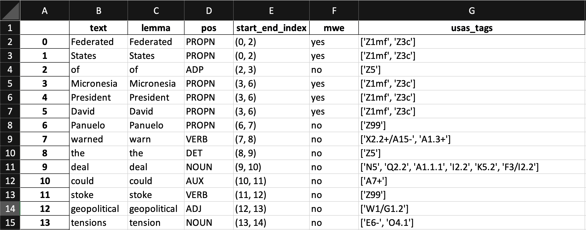

# HASS-60: Semantic-Tagger (English)

## Sydney Informatics Hub

<b>Abstract:</b> with the Semantic Tagger, you can use the [Python Multilingual Ucrel Semantic Analysis System (PyMUSAS)](https://ucrel.github.io/pymusas/) to tag your text data so that you can extract token level semantic tags from the tagged text. PyMUSAS, is a rule based token and Multi Word Expression (MWE) semantic tagger. The tagger can support any semantic tagset, however the currently released tagset is for the [UCREL Semantic Analysis System (USAS)](https://ucrel.lancs.ac.uk/usas/) sematic tags. 

In addition to the USAS tags, you will also see the lemmas and Part-ofSpeech (POS) tags in the text. For English, the tagger also identifies and tags Multi Word Expressions (MWE), i.e., expressions formed by two or more words that behave like a unit such as 'South Australia'.

## Setup
This tool has been designed for use with minimal setup from users. You are able to run it in the cloud and any dependencies with other packages will be installed for you automatically. In order to launch and use the tool, you just need to click the below icon.

TBC  
<b>Note:</b> this may take a few minutes to launch as Binder needs to install the dependencies for the tool.

## Languages
This Semantic Tagger supports English language. For Chinese, Italian, Spanish and Portuguese, please visit [this page](https://github.sydney.edu.au/informatics/HASS-60-Semantic-Tagger/tree/other_languages) or refer to the [PyMUSAS GitHub page](https://github.com/UCREL/pymusas) for other languages.

## Load the data
<table style='margin-left: 10px'><tr>
<td>  </td>
<td>  </td>
<td>  </td>
</tr></table>

This tagger will allow you to tag text data in a text file (or a number of text files). Alternatively, you can also tag text inside a text column inside your excel spreadsheet.

## Add Semantic Tags
Once your texts have been uploaded, you can begin to add semantic tags to the texts and download the results to your computer.

 

## Reference
This code has been adapted from the [PyMUSAS GitHub page](https://github.com/UCREL/pymusas) and modified to run on a Jupyter Notebook. PyMUSAS is an open-source project that has been created and funded by the [University Centre for Computer Corpus Research on Language (UCREL)](https://ucrel.lancs.ac.uk/) at [Lancaster University](https://www.lancaster.ac.uk/). For more information about PyMUSAS, please visit [the Usage Guides page](https://ucrel.github.io/pymusas/).
