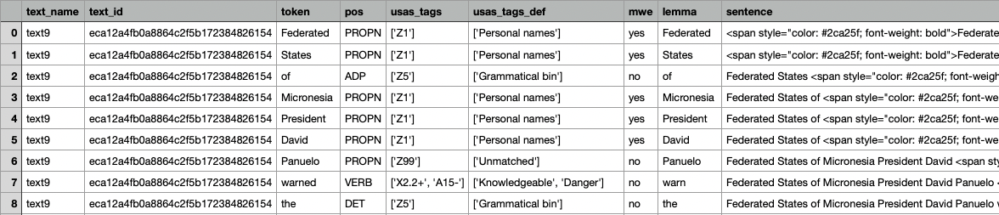
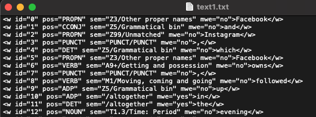

# Semantic-Tagger (English)

<b>Abstract:</b> with the Semantic Tagger, you can use [Python Multilingual Ucrel Semantic Analysis System (PyMUSAS)](https://ucrel.github.io/pymusas/) to tag your text so you can extract token level semantic tags from the tagged text. PyMUSAS, is a rule based token and Multi Word Expression (MWE) semantic tagger. The tagger can support any semantic tagset, however the currently released tagset is for the [UCREL Semantic Analysis System (USAS)](https://ucrel.lancs.ac.uk/usas/) semantic tags. 

In addition to the USAS tags, you will also see the lemmas and Part-of-Speech (POS) tags in the text. For English, the tagger also identifies and tags Multi Word Expressions (MWE), i.e., expressions formed by two or more words that behave like a unit such as 'South Australia'.

## Setup
This tool has been designed for use with minimal setup from users. You are able to run it in the cloud and any dependencies with other packages will be installed for you automatically. In order to launch and use the tool, you just need to click the below icon.

    

<b>Note:</b> CILogon authentication is required. You can use your institutional, Google or Microsoft account to login.  

If you do not have access to any of the above accounts, you can use the below link to access the tool (this is a free Binder version, limited to 2GB memory only).  

  

It may take a few minutes for Binder to launch the notebook and install the dependencies for the tool. Please be patient.  

## Languages
This Semantic Tagger supports English language. For Chinese, Italian and Spanish, please visit [this page](https://github.com/Australian-Text-Analytics-Platform/semantic-tagger/tree/multi-lingual) or refer to the [PyMUSAS GitHub page](https://github.com/UCREL/pymusas) for other languages.

## Load the data
<table style='margin-left: 10px'><tr>
<td>  </td>
<td>  </td>
<td>  </td>
<td>  </td>
</tr></table>

This tagger will allow you to tag text data in a text file (or a number of text files). Alternatively, you can also tag text inside a text column inside your excel spreadsheet.

<b>Note:</b> If you have a large number of text files (more than 10MB in total), we suggest you compress (zip) them and upload the zip file instead. If you need assistance on how to compress your file, please check [the user guide](https://github.com/Sydney-Informatics-Hub/HASS-29_Quotation_Tool/blob/main/documents/jupyter-notebook-guide.pdf).  

## Add Semantic Tags
Once your texts have been uploaded, you can begin to add semantic tags to the texts and analyse them using the tools included in the notebook. You can display the semantic tags, the pos-tagging and the MWE indicator for each token in a particular text, and compared them side by side with those from another text.

  
  

You can also compare the top-n statistics between texts (or all texts in the corpus) in the below charts.  
  
  

Lastly, you can save the tagged texts onto a comma separated values (csv) file containing the tagged texts, or a zip of pseudo-xml (.txt) tagged text files and download it to your local computer.    

csv format  
  

pseudo-xml format  
  

## Reference
This code has been adapted from the [PyMUSAS GitHub page](https://github.com/UCREL/pymusas) and modified to run on a Jupyter Notebook. PyMUSAS is an open-source project that has been created and funded by the [University Centre for Computer Corpus Research on Language (UCREL)](https://ucrel.lancs.ac.uk/) at [Lancaster University](https://www.lancaster.ac.uk/). For more information about PyMUSAS, please visit [the Usage Guides page](https://ucrel.github.io/pymusas/).  

## Citation  
If you find the Semantic Tagger useful in your research, please cite the following:

Jufri, Sony & Sun, Chao (2022). Semantic Tagger. v1.0. Australian Text Analytics Platform. Software. https://github.com/Australian-Text-Analytics-Platform/semantic-tagger